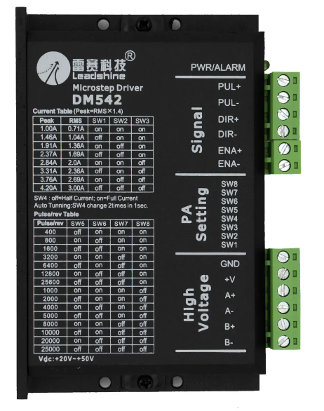
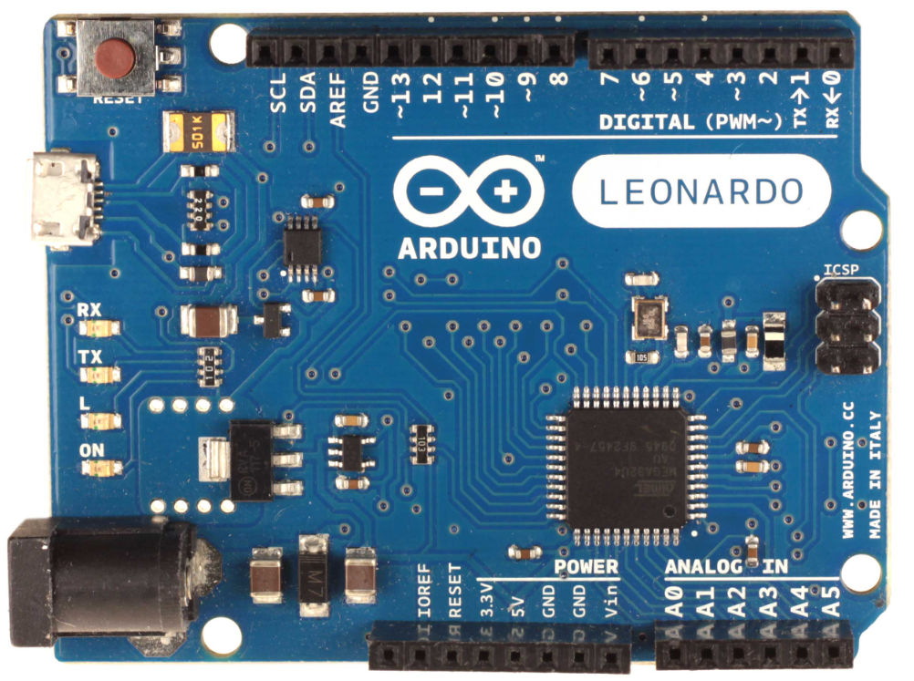
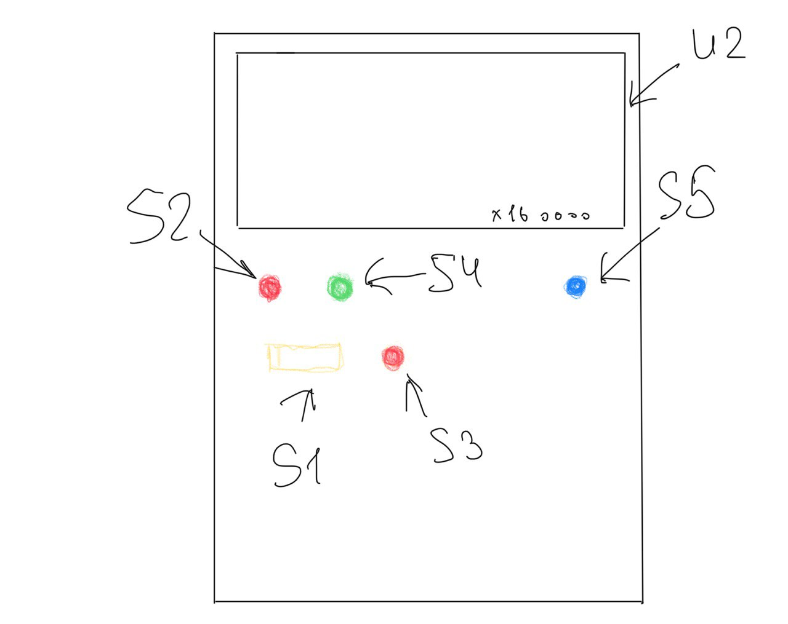

# Engine_Controller
Используемый цифровой драйвер:

Используемая плата arduino:

##### В случае если повредили провод (как переобжать)

##### Назначение RJ-45
###### Со стороны arduino
1. бело-оранжевый: 13pin digital (к DIR+)
2. оранжевый: 12pin digital (к ENA+)
3. бело-зелёный: питание+
4. синий: (земля) ground pins шина
5. бело-синий: 10pin digital (к PUL+)
6. зелёный: питание-
7. бело-коричневый: не используется
8. коричневый: не используется
###### Со стороны станка
1. бело-оранжевый: DIR+ (к 13pin digital)
2. оранжевый: ENA+ (к 12pin digital)
3. бело-зелёный: питание+
4. синий: (земля) ground pins шина
5. бело-синий: PUL+ (к 10pin digital)
6. зелёный: питание-
7. бело-коричневый: не используется
8. коричневый: не используется

##### Цепь

##### Схема .pdf
            Схема ↓
Схема >  < Схема  
                    *Схема ↑
##### Как примерно будет выглядить пульт
