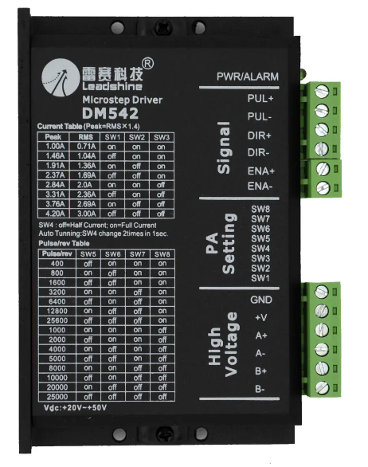

# Engine_Controller
Используемый цифровой драйвер:

##### В случае если повредили провод (как переобжать)

##### Назначение RJ-45
###### Со стороны arduino
1. бело-оранжевый: 13 pin digital (к direction +)
2. оранжевый: 12 pin digital (к enable +)
3. бело-зелёный: питание +
4. синий: (земля) ground pins шина
5. бело-синий: 10 pin digital (к step +)
6. зелёный: питание -
7. бело-коричневый: не используется
8. коричневый: не используется
###### Со стороны станка
1. бело-оранжевый: direction + (к 13 pin digital)
2. оранжевый: enable + (к 12 pin digital)
3. бело-зелёный: питание +
4. синий: (земля) ground pins шина
5. бело-синий: step + (к 10 pin digital)
6. зелёный: питание -
7. бело-коричневый: не используется
8. коричневый: не используется

##### Цепь

##### Схема .pdf
